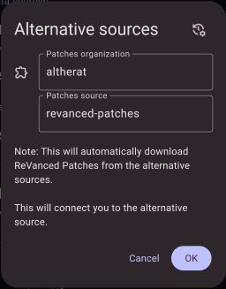

### This repo is not maintained
See wchill's patches that are more up-to-date: https://github.com/wchill/patcheddit

---

This is a fork of https://github.com/ReVanced/revanced-patches with an attempt to fix Reddit is Fun (RIF).

Since you can no longer create API keys on Reddit, the latest method to get RIF working is to install [RedReader](https://github.com/QuantumBadger/RedReader) or [Infinity+](https://github.com/Docile-Alligator/Infinity-For-Reddit) and then login to these apps to receive an email with an API key you can then use with ReVanced. This works, but I could not log into RIF and I frequently got 403 forbidden errors browsing anonymously.

My goal was to create a ReVanced patch to log in to RIF because I believe doing so might prevent the 403 forbidden errors. I've never created a ReVanced patch before so I'm surprised I got something working but I have not tested it thoroughly. I had the help of looking through wchill's code for his Boost for Reddit patch (https://github.com/wchill/revanced-patches)

# Steps
1. Install [RedReader](https://github.com/QuantumBadger/RedReader/releases) from an APK or from the [Google Play Store](https://play.google.com/store/apps/details?id=org.quantumbadger.redreader)
2. Open RedReader and login
3. Wait for an email that has an "App ID" token and copy it
4. Install [ReVanced](https://revanced.app/)

5. Download and install the latest RIF Golden Platinum APK (5.6.22) from some APK provider website

6. Go into ReVanced settings and select `Alternative sources` to point to this repository

7. Press `OK` and restart ReVanced
8. Open the patcher and select the RIF APK from storage
10. Select the `Spoof client` patch and press the cog in the top-right
11. Paste your RedReader App ID under `OAuth client ID`, and put `redreader://rr_oauth_redir` for the `Redirect URI`
12. Press `Save` and `Done` and then `Patch`
13. Press the `Install` button and install the patched app (make sure you remove any RIF you have installed first)
14. Open RIF and log in (if you get invalid username/password, you need to use a VPN (don't know why) and change to some European country. I used ProtonVPN (free) and changed servers until getting one that works)
